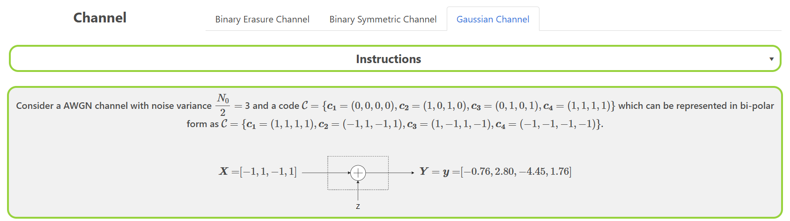

### Procedure

The experiment consists of three sub-experiments, through which the user will be systematically understanding the essential mathematical aspects of three important probabilistic channels, discussed in the theory part of this experiment. These channels are : 

1. The Binary Erasure Channel, which erases each bit transmitted independently with probability $\epsilon$. The erasure symbol is denoted by $?$. 
2. The Binary Symmetric Channel, which flips the bit transmitted independently with probability $p$. 
3. The Additive White Gaussian Channel, which adds a real and independent noise value (sampled from a Gaussian distribution with $0$ mean and variance $N_0/2$). 

The detailed working of this experiment is as follows. 

## Overview of the Experiment window

    

The experiment window consists of the following components:
1. **Task tab**: The task tab contains the list of tasks that need to be performed in the experiment. The user can navigate to any task by clicking on the corresponding task in the task tab.
2. **Instruction box**: The instruction box displays step-by-step instructions to perform the task.
3. **Question box**: The question box displays the question to be answered by the user.
4. **Observation box**: The observation box displays the feedback messages based on the user's input.
5. **Action box**: The action box contains the input elements and buttons to perform the task.

## Experiment 3: Maximum Likelihood Decoding of Linear Codes on Binary-Input Memoryless Channels

There are three tasks in this sub-experiment.

### Task 1: Binary Erasure Channel

1. **Enter Maximum Likelihood**: For the given $BEC(\epsilon)$ channel and a code $\mathcal{C}$, enter the likelihood of receiving the output $\vec{y}$ given each of the codewords of the code. Enter the values in the input boxes given. Then select the codeword that has the maximum likelihood of being transmitted.
    
  

     
    <ul>
    <li> Click on <strong>Submit</strong> to verify if the entered values are correct. </li>
    <li> Click on <strong>Reset</strong> to clear the input boxes and start over. </li>
    <li> Click on <strong>Next</strong> to go to the next sub-experiment.  </li>
    <li> The observation box will display feedback messages accordingly. </li>  
    </ul>
    

     
    
    
    
    

2. **Select Vectors**: For a given output $\vec{y}$ for a $BEC(\epsilon)$ channel, select all of the below vectors which cannot be possible inputs to the $BEC(\epsilon)$ channel.
    
  

     
    <ul>
    <li> Click on <strong>Submit</strong> to verify if the entered values are correct. </li>
    <li> Click on <strong>Previous</strong> to go to the previous sub-experiment.  </li>
    <li> The observation box will display feedback messages accordingly. </li>  
    </ul>
    

     
    
    
    

### Task 2: Binary Symmetric Channel

1. **Enter Maximum Likelihood**: For the given $BSC(p)$ channel and a code $\mathcal{C}$, enter the likelihood of receiving the output $\vec{y}$ given each of the codewords of the code. Enter the values in the input boxes given. Then select the codeword that has the maximum likelihood of being transmitted.
    
  

     
    <ul>
    <li> Click on <strong>Submit</strong> to verify if the selected vectors are the possible output vectors. </li>
    <li> Click on <strong>Reset</strong> to start over the experiment from the previous sub-experiment. </li>
    <li> Click on <strong>Next</strong> to go to the next sub-experiment.  </li>
    <li> The observation box will display feedback messages accordingly. </li>  
    </ul>
    

     
    
    
    

2. **Select Vectors**: For a given output $\vec{y}$ for a $BSC(p)$ channel, select all of the below vectors which cannot be possible inputs to the $BSC(p)$ channel.
    
  

     
    <ul>
    <li> Click on <strong>Submit</strong> to verify if the entered probabilities are correct. </li>
    <li> Click on <strong>Previous</strong> to go to the previous sub-experiment.  </li>
    <li> The observation box will display feedback messages accordingly. </li>  
    </ul>
    

     
    
    
    

### Task 3: Additive White Gaussian Channel

1. **Enter Maximum Likelihood**: For the given AWGN channel and a code $\mathcal{C}$, enter the likelihood of receiving the output $\vec{y}$ given each of the codewords of the code. Enter the values in the input boxes given. Then select the codeword that has the maximum likelihood of being transmitted.
    
  
    
     

     
    <ul>
    <li> Enter the likelihoods of $boldsymbol{y}$ given codewords and click on the "Check" button to verify the likelihoods. Observation box will display feedback messages accordingly.
    </li>
    <li> After entering the likelihoods for all the codewords, Select the maximum likelihood estimate codeword from the dropdown. 
    </li>
    <li> Click on "Yes" if the maximum likelihood estimate codeword is same as the transmitted codeword, else click on "No". "Next" button will appear after selecting the correct option. 
    </li>
    </ul>

    

2. **Select Vectors**: For a given output $\vec{y}$ for an AWGN channel, select all of the below vectors which lead to a decoding error.
    
  

     
    <ul>
    <li> Select all the received vectors that lead to a decoding error when using maximum likelihood decoding.
    </li>
    </ul>

    
